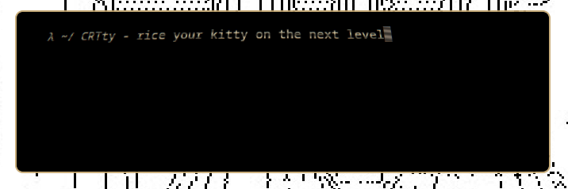

# CRTty

<p align="center">
  <a href="https://aur.archlinux.org/packages/crtty-git"></a>
  <a href="https://crates.io/crates/crtty"></a>
  <a href="https://www.rust-lang.org/"></a>
</p>

**Post-processing shader framework for [kitty](https://sw.kovidgoyal.net/kitty/) terminal via `LD_PRELOAD`**


<p align="center">
  
</p>

Inject custom fragment shaders into kitty (or any EGL/GLX application) —
no patches, no Vulkan, no special drivers.  Ships with a built-in
**CRT monitor** effect (scanlines, phosphor glow, barrel distortion,
vignette, chromatic aberration).

## Installation

Requires **Linux with glibc**, **OpenGL 3.3+**, and **Rust stable** (build only).

### From source

```bash
git clone https://github.com/kosa/CRTty && cd CRTty
make install        # builds + installs to ~/.local
```

### Arch Linux (AUR)

```bash
yay -S crtty
```

### Nix

```bash
nix profile install github:kosa/CRTty
```

### System-wide

```bash
sudo make PREFIX=/usr install
```

### Uninstall

```bash
make uninstall
```

## Usage

```bash
crtty                        # launch kitty with CRT effect (default)
crtty --list                 # show all available effects
crtty -s greyscale           # use a different effect
crtty -s ./my_shader.glsl    # use a custom GLSL file
crtty -s crt -- --hold       # pass extra args to kitty
```

Custom `.glsl` shaders are **hot-reloaded** - edit the file, save, and
the effect updates live without restarting kitty. Changes are picked up
on the next kitty redraw (cursor blink, typing, any terminal output).
If the shader fails to compile, the previous shader stays active and the
GLSL error is printed to stderr.

### Custom GLSL shaders

Write a standard GLSL 330 core fragment shader. It receives these inputs
automatically:

| Uniform / Input | Type | Description |
|-----------------|------|-------------|
| `in vec2 v_uv` | vec2 | Texture coordinates (0–1) |
| `uniform sampler2D u_input` | sampler2D | Screen contents |
| `uniform float u_time` | float | Seconds since init (for animation) |
| `uniform vec2 u_resolution` | vec2 | Viewport size in pixels |

Must write `out vec4 o_color`. All uniforms except `u_input` are optional.

Example — animated RGB wave:

```glsl
#version 330 core
in vec2 v_uv;
out vec4 o_color;
uniform sampler2D u_input;
uniform float u_time;
uniform vec2 u_resolution;

void main() {
    float wave = sin(v_uv.y * 40.0 + u_time * 3.0) * 0.003;
    vec3 c;
    c.r = texture(u_input, v_uv + vec2(wave, 0.0)).r;
    c.g = texture(u_input, v_uv).g;
    c.b = texture(u_input, v_uv - vec2(wave, 0.0)).b;
    float scan = 0.95 + 0.05 * sin(v_uv.y * u_resolution.y * 3.14 + u_time * 2.0);
    o_color = vec4(c * scan, 1.0);
}
```

```bash
crtty -s ./wave.glsl
```

See `examples/` for more sample shaders.

## Write your own effect

Create a new Rust library crate:

```bash
cargo new --lib my-shader && cd my-shader
```

`Cargo.toml`:

```toml
[lib]
crate-type = ["cdylib"]

[dependencies]
crtty = { git = "https://github.com/<you>/CRTty" }
```

`src/lib.rs`:

```rust
struct Grayscale;

impl crtty::Effect for Grayscale {
    fn fragment_shader(&self) -> &str {
        "#version 330 core
         in vec2 v_uv;
         out vec4 o_color;
         uniform sampler2D u_input;
         void main() {
             vec3 c = texture(u_input, v_uv).rgb;
             float l = dot(c, vec3(0.299, 0.587, 0.114));
             o_color = vec4(l, l, l, 1.0);
         }"
    }
}

crtty::main!(Grayscale);
```

Build and use:

```bash
cargo build --release
LD_PRELOAD=$(pwd)/target/release/libmy_shader.so ENABLE_CRTTY=1 kitty
```

## The `Effect` trait

```rust
pub trait Effect: Send + 'static {
    /// GLSL 330 core fragment shader.
    /// Receives `in vec2 v_uv` and `uniform sampler2D u_input`.
    /// Must write `out vec4 o_color`.
    fn fragment_shader(&self) -> &str;

    /// Called once after shader compilation. Cache uniform locations here.
    fn setup(&mut self, _program: u32) {}

    /// Called each frame. Set your custom uniforms.
    fn set_uniforms(&self, _program: u32, _w: i32, _h: i32, _frame: u64) {}

    /// Per-frame toggle. Default: true.
    fn enabled(&self) -> bool { true }

    /// Env var that must be "1" to activate. Default: "ENABLE_CRTTY".
    fn env_var(&self) -> Option<&str> { Some("ENABLE_CRTTY") }
}
```

Helpers for setting uniforms:

```rust
crtty::gl::get_uniform_location(program, "my_param")  // -> i32
crtty::gl::uniform_1f(location, 0.5)
crtty::gl::uniform_1i(location, 1)
```

## How it works

```
App (GLFW / EGL / GLX)
  │
  ├─ dlsym(handle, "eglSwapBuffers")
  │     ↑ intercepted by your .so
  │
  └─ eglSwapBuffers(dpy, surface)
       ├─ glCopyTexSubImage2D → capture framebuffer
       ├─ Bind your shader (GLSL 330 core)
       ├─ Your set_uniforms() runs
       ├─ Draw fullscreen triangle
       └─ Call real eglSwapBuffers
```

## Project structure

```
src/
  lib.rs          Effect trait, main! macro
  hook.rs         dlsym interception
  pass.rs         Render pass engine
  gl.rs           GL function pointers + helpers
  config.rs       Config file parser
  effects/
    crt.rs        Built-in CRT effect
    greyscale.rs  Greyscale effect
    invert.rs     Color inversion effect
    custom.rs     Runtime GLSL file loader
cli/
  src/main.rs     CLI launcher (crtty binary)
crt/
  src/lib.rs      Default cdylib (Builtin::from_env())
examples/
  wave.glsl       Animated RGB wave + scanlines
PKGBUILD          Arch Linux / AUR package
flake.nix         Nix flake
```

## CRT effect configuration

Edit `~/.config/crtty.conf`:

```ini
enabled=1
scanline_intensity=0.75
phosphor_strength=1.1
curvature=0.04
vignette=0.35
aberration=0.003
```

| Parameter | Range | Description |
|-----------|-------|-------------|
| `enabled` | `0`/`1` | Master switch |
| `scanline_intensity` | 0.0–1.0 | Horizontal raster line darkness |
| `phosphor_strength` | 0.0–3.0 | Bloom intensity |
| `curvature` | 0.0–0.5 | Barrel distortion |
| `vignette` | 0.0–2.0 | Corner darkening |
| `aberration` | 0.0–0.05 | RGB channel offset |

## License

MIT


